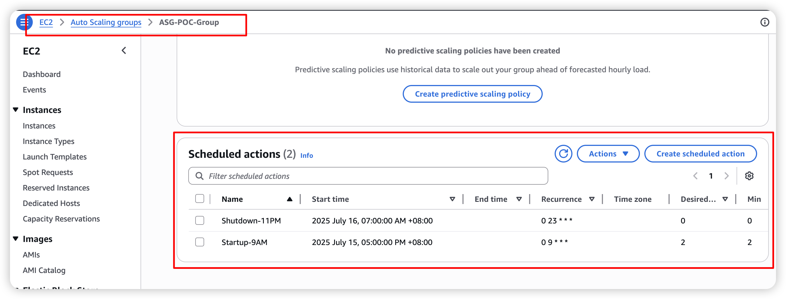
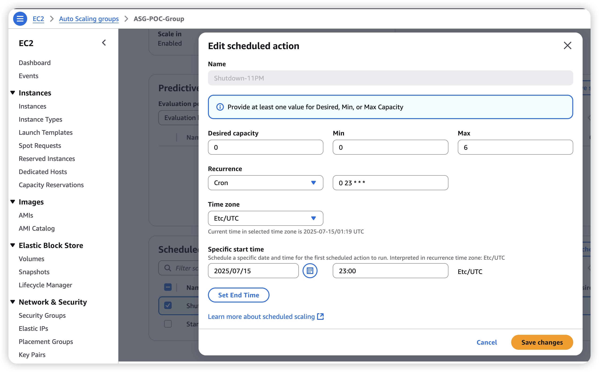
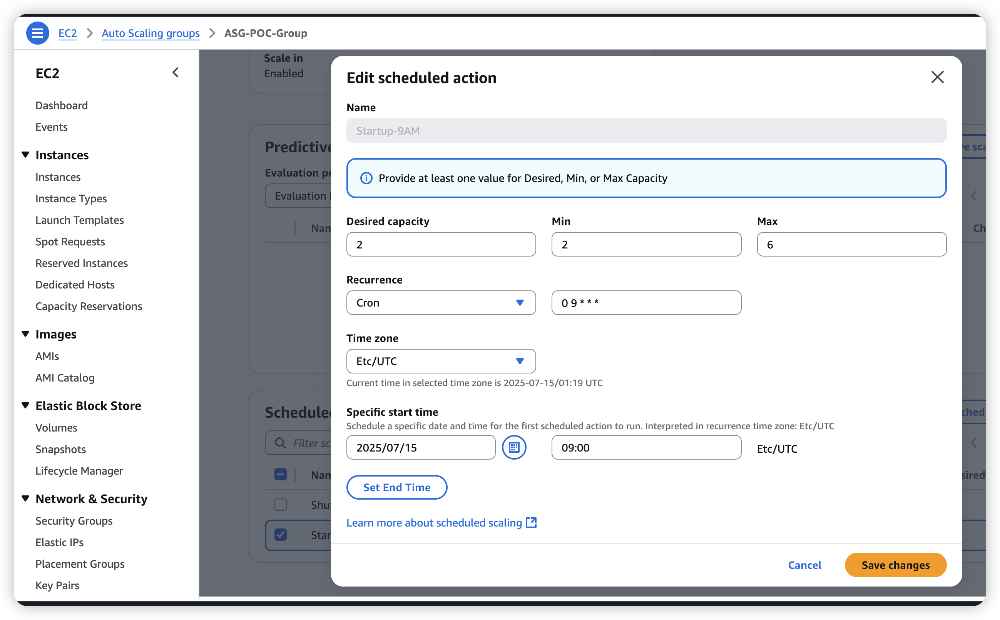

# AWS Auto Scaling Group 定时开关机与CPU自动扩缩容项目需求


#### 核心业务需要： 

AWS宁夏区域ASG定时开关机POC节省费用，   • 关机时间：晚上11点   • 开机时间：早上9点

#### 快速技术实现截图：







#### 创建定时扩缩容策略

#### 7.1 创建晚上11点关机的定时操作

```bash
aws autoscaling put-scheduled-update-group-action \
  --auto-scaling-group-name ASG-POC-Group \
  --scheduled-action-name "Shutdown-11PM" \
  --recurrence "0 23 * * *" \
  --desired-capacity 0 \
  --min-size 0 \
  --max-size 6 \
  --profile china \
  --region cn-northwest-1
```

#### 7.2 创建早上9点开机的定时操作

```bash
aws autoscaling put-scheduled-update-group-action \
  --auto-scaling-group-name ASG-POC-Group \
  --scheduled-action-name "Startup-9AM" \
  --recurrence "0 9 * * *" \
  --desired-capacity 2 \
  --min-size 2 \
  --max-size 6 \
  --profile china \
  --region cn-northwest-1
```

## 


## 项目概述

本项目旨在实现一个基于AWS Auto Scaling Group的智能实例管理系统，结合定时开关机和CPU自动扩缩容功能，以优化成本控制和性能弹性。

## 业务需求

### 1. 成本优化需求
- **问题**: GPU实例（g4dn.xlarge）成本较高，非工作时间运行造成资源浪费
- **解决方案**: 实现定时开关机，在非工作时间自动关闭所有实例
- **预期收益**: 每天节省约8小时的实例运行成本（约33%成本节省）

### 2. 性能弹性需求
- **问题**: 工作负载波动较大，固定实例数量无法适应业务需求
- **解决方案**: 基于CPU使用率的自动扩缩容
- **预期收益**: 高负载时自动扩容保证性能，低负载时自动缩容节省成本

### 3. 运维自动化需求
- **问题**: 手动管理实例开关机和扩缩容操作繁琐且容易出错
- **解决方案**: 全自动化的实例生命周期管理
- **预期收益**: 减少运维工作量，提高系统可靠性

## 技术需求

### 1. 基础架构需求

#### 1.1 云平台
- **平台**: AWS中国区域（宁夏 cn-northwest-1）
- **服务**: Auto Scaling Group, EC2, CloudWatch, IAM, Systems Manager

#### 1.2 实例规格
- **实例类型**: g4dn.xlarge (GPU实例)
- **操作系统**: Amazon Linux 2
- **网络**: 默认VPC，多可用区部署

#### 1.3 容量规划
- **关机时段**: 0台实例（23:00-09:00 UTC）
- **开机时段**: 最小2台，最大6台实例（09:00-23:00 UTC）
- **健康检查**: EC2健康检查，300秒宽限期

### 2. 定时开关机需求

#### 2.1 时间配置
- **关机时间**: 每天23:00 UTC（北京时间07:00）
- **开机时间**: 每天09:00 UTC（北京时间17:00）
- **时区**: 所有操作基于UTC时间

#### 2.2 关机操作
- 设置ASG期望容量为0
- 设置最小实例数为0
- 保持最大实例数为6（为开机时段准备）

#### 2.3 开机操作
- 设置ASG期望容量为2
- 设置最小实例数为2
- 设置最大实例数为6

### 3. CPU自动扩缩容需求

#### 3.1 扩容条件
- **触发条件**: CPU平均使用率持续超过70%
- **评估周期**: 2个周期，每个周期5分钟
- **扩容动作**: 每次增加1台实例
- **冷却时间**: 300秒

#### 3.2 缩容条件
- **触发条件**: CPU平均使用率持续低于30%
- **评估周期**: 2个周期，每个周期5分钟
- **缩容动作**: 每次减少1台实例
- **最小限制**: 开机时段内不低于2台实例

#### 3.3 扩缩容策略
- **主策略**: 目标跟踪扩缩容（维持CPU使用率在70%左右）
- **备用策略**: 简单扩缩容策略（基于CloudWatch告警）

### 4. 监控和告警需求

#### 4.1 CloudWatch指标
- ASG实例数量变化
- CPU使用率监控
- 扩缩容活动日志
- 实例健康状态

#### 4.2 告警配置
- CPU高使用率告警（>70%）
- CPU低使用率告警（<30%）
- 实例启动失败告警
- ASG异常状态告警

### 5. 安全需求

#### 5.1 网络安全
- 使用专用安全组
- 限制SSH访问（仅必要时开放）
- 实例部署在私有子网（可选）

#### 5.2 访问控制
- IAM角色最小权限原则
- 使用Systems Manager Session Manager代替SSH
- 实例配置文件权限控制

#### 5.3 数据安全
- 重要数据存储在EBS或S3
- 实例终止时数据保护策略
- 定期备份机制

## 功能需求

### 1. 核心功能

#### 1.1 自动化部署
- 一键部署脚本
- 资源依赖自动处理
- 配置参数化管理

#### 1.2 状态监控
- 实时状态查询
- 扩缩容活动跟踪
- 性能指标展示

#### 1.3 压力测试
- CPU压力测试工具
- 扩缩容功能验证
- 性能基准测试

#### 1.4 资源清理
- 一键清理脚本
- 资源依赖清理
- 成本控制保护

### 2. 管理功能

#### 2.1 配置管理
- 时间配置调整
- 容量参数修改
- 策略参数优化

#### 2.2 故障处理
- 常见问题诊断
- 自动恢复机制
- 手动干预接口

#### 2.3 成本控制
- 成本预算设置
- 使用量监控
- 优化建议提供

## 非功能需求

### 1. 性能需求
- 扩缩容响应时间: <10分钟
- 实例启动时间: <5分钟
- 监控数据延迟: <5分钟

### 2. 可靠性需求
- 系统可用性: 99.9%
- 定时操作准确性: 100%
- 扩缩容成功率: >95%

### 3. 可维护性需求
- 代码模块化设计
- 详细的文档说明
- 标准化的配置管理

### 4. 可扩展性需求
- 支持多区域部署
- 支持不同实例类型
- 支持自定义扩缩容策略

## 交付物

### 1. 代码交付
- [x] 一键部署脚本 (`deploy-asg.sh`)
- [x] 资源清理脚本 (`cleanup-asg.sh`)
- [x] 状态验证脚本 (`verify-asg.sh`)
- [x] CPU压力测试脚本 (`cpu-stress-test.sh`)
- [x] IAM策略配置文件

### 2. 文档交付
- [x] 详细配置文档 (`ASG-AutoShutdown-POC.md`)
- [x] 项目说明文档 (`README.md`)
- [x] 项目需求文档 (`PROJECT-REQUIREMENTS.md`)
- [x] 故障排除指南

### 3. 配置交付
- [x] 启动模板配置
- [x] Auto Scaling Group配置
- [x] CloudWatch告警配置
- [x] 定时操作配置

## 验收标准

### 1. 功能验收
- [ ] 定时开关机功能正常工作
- [ ] CPU自动扩缩容功能正常工作
- [ ] 监控告警功能正常工作
- [ ] 压力测试功能正常工作

### 2. 性能验收
- [ ] 扩缩容响应时间满足要求
- [ ] 实例启动时间满足要求
- [ ] CPU使用率监控准确

### 3. 安全验收
- [ ] IAM权限配置正确
- [ ] 网络安全配置合规
- [ ] 数据安全措施到位

### 4. 文档验收
- [ ] 部署文档完整准确
- [ ] 操作手册清晰易懂
- [ ] 故障排除指南实用

## 成本估算

### 1. 基础成本
- **实例成本**: g4dn.xlarge @ $0.526/小时
- **基础运行**: 2台实例 × 14小时/天 = $14.73/天
- **月度基础成本**: ~$440/月

### 2. 扩容成本
- **高峰期**: 最多6台实例
- **高峰成本**: 6台实例 × 14小时/天 = $44.19/天
- **月度最高成本**: ~$1,320/月

### 3. 预期成本
- **平均负载**: 预计平均3-4台实例
- **预期月成本**: $660-880/月
- **成本节省**: 相比24小时运行节省约33%

## 风险评估

### 1. 技术风险
- **风险**: 扩缩容策略配置不当导致频繁扩缩容
- **缓解**: 充分测试和调优冷却时间参数

### 2. 成本风险
- **风险**: 扩缩容失控导致成本超预算
- **缓解**: 设置成本预算告警和最大实例数限制

### 3. 业务风险
- **风险**: 定时关机影响紧急业务需求
- **缓解**: 提供手动干预机制和紧急启动流程

### 4. 运维风险
- **风险**: 自动化系统故障导致服务中断
- **缓解**: 完善的监控告警和故障恢复机制

## 后续优化建议

### 1. 成本优化
- 考虑使用Spot实例降低成本
- 评估Reserved Instance的适用性
- 实施更精细的时间调度策略

### 2. 性能优化
- 基于更多指标的扩缩容策略（内存、网络等）
- 预测性扩缩容算法
- 应用级别的负载均衡

### 3. 功能增强
- 多区域部署支持
- 蓝绿部署集成
- CI/CD流水线集成

### 4. 监控增强
- 自定义Dashboard
- 更丰富的告警策略
- 性能趋势分析
